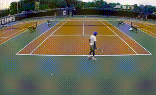

<h1><strong>Motion Detection with OpenCV</strong></h1>
This project demonstrates a motion detection system using OpenCV and <code>skvideo.io</code> for reading video data. The system processes video frames, detects changes between consecutive frames, and highlights regions of motion with bounding boxes.
<h2><strong>Table of Contents</strong></h2><ul><li><a rel="noopener" style="--streaming-animation-state: var(--batch-play-state-1); --animation-rate: var(--batch-play-rate-1);" href="#project-overview">Project Overview</a></li><li><a rel="noopener" style="--streaming-animation-state: var(--batch-play-state-1); --animation-rate: var(--batch-play-rate-1);" href="#requirements">Requirements</a></li><li><a rel="noopener" style="--streaming-animation-state: var(--batch-play-state-1); --animation-rate: var(--batch-play-rate-1);" href="#installation">Installation</a></li><li><a rel="noopener" style="--streaming-animation-state: var(--batch-play-state-1); --animation-rate: var(--batch-play-rate-1);" href="#usage">Usage</a></li><li><a rel="noopener" style="--streaming-animation-state: var(--batch-play-state-1); --animation-rate: var(--batch-play-rate-1);" href="#motion-detection-demo">Motion Detection Demo</a></li><li><a rel="noopener" style="--streaming-animation-state: var(--batch-play-state-1); --animation-rate: var(--batch-play-rate-1);" href="#license">License</a></li></ul><h2><strong>Project Overview</strong></h2>
The goal of this project is to detect motion in a video. The project loads a video, iterates through its frames, calculates the difference between consecutive frames, and draws bounding boxes around areas where motion is detected.

The project is implemented using:
<ul><li>OpenCV for image processing.</li><li><code>skvideo.io</code> for reading the video data.</li><li>Python for the overall logic.</li></ul><h2><strong>Requirements</strong></h2>
To run this project, you need the following dependencies installed:
<ul><li>Python 3.x</li><li>OpenCV</li><li><code>skvideo</code></li></ul>
You can install the required packages using <code>pip</code>:
<pre class="!overflow-visible">

bash

<button class="flex gap-1 items-center py-1"><svg width="24" height="24" viewBox="0 0 24 24" fill="none" xmlns="http://www.w3.org/2000/svg" class="icon-sm"><path fill-rule="evenodd" clip-rule="evenodd" d="M7 5C7 3.34315 8.34315 2 10 2H19C20.6569 2 22 3.34315 22 5V14C22 15.6569 20.6569 17 19 17H17V19C17 20.6569 15.6569 22 14 22H5C3.34315 22 2 20.6569 2 19V10C2 8.34315 3.34315 7 5 7H7V5ZM9 7H14C15.6569 7 17 8.34315 17 10V15H19C19.5523 15 20 14.5523 20 14V5C20 4.44772 19.5523 4 19 4H10C9.44772 4 9 4.44772 9 5V7ZM5 9C4.44772 9 4 9.44772 4 10V19C4 19.5523 4.44772 20 5 20H14C14.5523 20 15 19.5523 15 19V10C15 9.44772 14.5523 9 14 9H5Z" fill="currentColor"></path></svg>Copy code</button>

<code class="!whitespace-pre hljs language-bash">pip install opencv-python-headless sk-video
</code>

</pre><h2><strong>Installation</strong></h2><ol><li>
<strong>Clone the repository:</strong>
<pre class="!overflow-visible">

bash

<button class="flex gap-1 items-center py-1"><svg width="24" height="24" viewBox="0 0 24 24" fill="none" xmlns="http://www.w3.org/2000/svg" class="icon-sm"><path fill-rule="evenodd" clip-rule="evenodd" d="M7 5C7 3.34315 8.34315 2 10 2H19C20.6569 2 22 3.34315 22 5V14C22 15.6569 20.6569 17 19 17H17V19C17 20.6569 15.6569 22 14 22H5C3.34315 22 2 20.6569 2 19V10C2 8.34315 3.34315 7 5 7H7V5ZM9 7H14C15.6569 7 17 8.34315 17 10V15H19C19.5523 15 20 14.5523 20 14V5C20 4.44772 19.5523 4 19 4H10C9.44772 4 9 4.44772 9 5V7ZM5 9C4.44772 9 4 9.44772 4 10V19C4 19.5523 4.44772 20 5 20H14C14.5523 20 15 19.5523 15 19V10C15 9.44772 14.5523 9 14 9H5Z" fill="currentColor"></path></svg>Copy code</button>

<code class="!whitespace-pre hljs language-bash">git clone https://github.com/your_username/your_project.git
cd your_project
</code>

</pre></li><li>
<strong>Install dependencies:</strong>
<pre class="!overflow-visible">

bash

<button class="flex gap-1 items-center py-1"><svg width="24" height="24" viewBox="0 0 24 24" fill="none" xmlns="http://www.w3.org/2000/svg" class="icon-sm"><path fill-rule="evenodd" clip-rule="evenodd" d="M7 5C7 3.34315 8.34315 2 10 2H19C20.6569 2 22 3.34315 22 5V14C22 15.6569 20.6569 17 19 17H17V19C17 20.6569 15.6569 22 14 22H5C3.34315 22 2 20.6569 2 19V10C2 8.34315 3.34315 7 5 7H7V5ZM9 7H14C15.6569 7 17 8.34315 17 10V15H19C19.5523 15 20 14.5523 20 14V5C20 4.44772 19.5523 4 19 4H10C9.44772 4 9 4.44772 9 5V7ZM5 9C4.44772 9 4 9.44772 4 10V19C4 19.5523 4.44772 20 5 20H14C14.5523 20 15 19.5523 15 19V10C15 9.44772 14.5523 9 14 9H5Z" fill="currentColor"></path></svg>Copy code</button>

<code class="!whitespace-pre hljs language-bash">pip install -r requirements.txt
</code>

</pre></li><li>
<strong>Add your video file:</strong> Place the video file you want to process in the project directory. Example:
<pre class="!overflow-visible">

bash

<button class="flex gap-1 items-center py-1"><svg width="24" height="24" viewBox="0 0 24 24" fill="none" xmlns="http://www.w3.org/2000/svg" class="icon-sm"><path fill-rule="evenodd" clip-rule="evenodd" d="M7 5C7 3.34315 8.34315 2 10 2H19C20.6569 2 22 3.34315 22 5V14C22 15.6569 20.6569 17 19 17H17V19C17 20.6569 15.6569 22 14 22H5C3.34315 22 2 20.6569 2 19V10C2 8.34315 3.34315 7 5 7H7V5ZM9 7H14C15.6569 7 17 8.34315 17 10V15H19C19.5523 15 20 14.5523 20 14V5C20 4.44772 19.5523 4 19 4H10C9.44772 4 9 4.44772 9 5V7ZM5 9C4.44772 9 4 9.44772 4 10V19C4 19.5523 4.44772 20 5 20H14C14.5523 20 15 19.5523 15 19V10C15 9.44772 14.5523 9 14 9H5Z" fill="currentColor"></path></svg>Copy code</button>

<code class="!whitespace-pre hljs language-bash">mv your_video.mp4 .
</code>

</pre></li></ol><h2><strong>Usage</strong></h2><ol><li>
<strong>Run the script:</strong>
<pre class="!overflow-visible">

bash

<button class="flex gap-1 items-center py-1"><svg width="24" height="24" viewBox="0 0 24 24" fill="none" xmlns="http://www.w3.org/2000/svg" class="icon-sm"><path fill-rule="evenodd" clip-rule="evenodd" d="M7 5C7 3.34315 8.34315 2 10 2H19C20.6569 2 22 3.34315 22 5V14C22 15.6569 20.6569 17 19 17H17V19C17 20.6569 15.6569 22 14 22H5C3.34315 22 2 20.6569 2 19V10C2 8.34315 3.34315 7 5 7H7V5ZM9 7H14C15.6569 7 17 8.34315 17 10V15H19C19.5523 15 20 14.5523 20 14V5C20 4.44772 19.5523 4 19 4H10C9.44772 4 9 4.44772 9 5V7ZM5 9C4.44772 9 4 9.44772 4 10V19C4 19.5523 4.44772 20 5 20H14C14.5523 20 15 19.5523 15 19V10C15 9.44772 14.5523 9 14 9H5Z" fill="currentColor"></path></svg>Copy code</button>

<code class="!whitespace-pre hljs language-bash">python motion_detection.py
</code>

</pre></li><li>
The script will:
<ul><li>Load the specified video file.</li><li>Iterate through the frames.</li><li>Detect differences between consecutive frames.</li><li>Draw bounding boxes around regions where motion is detected.</li><li>Display the original frame and the motion-detected frame side by side.</li></ul></li><li>
<strong>Controls:</strong> Press <code>q</code> to exit the video window.
</li></ol><h2><strong>Motion Detection Demo</strong></h2>

<h2><strong>License</strong></h2>
This project is licensed under the MIT License. See the <code>LICENSE</code> file for more details.

